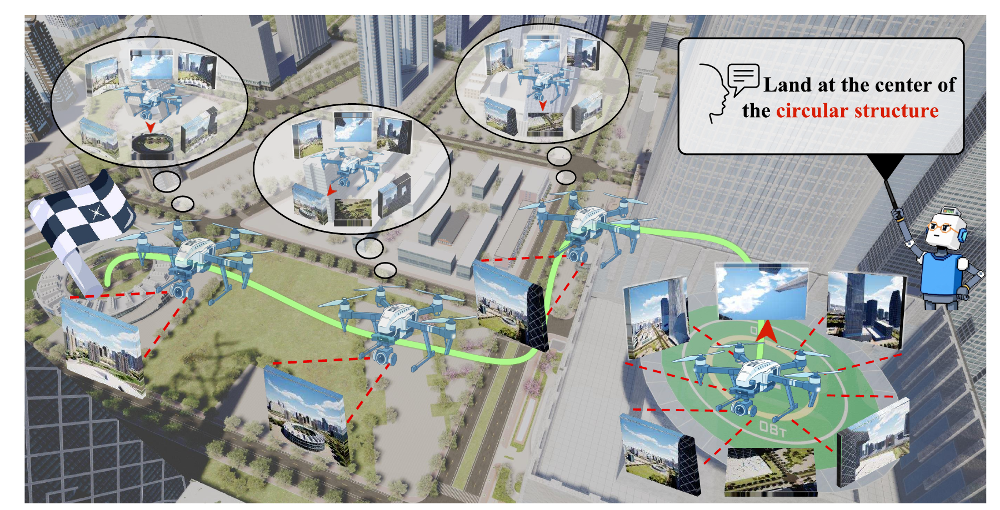

# SAWMAN: Spatial-Aware World Model Agent for Aerial Embodied Navigation

SAWMAN explores action-conditioned six-view prediction for aerial navigation.
This repository releases the **data collection, world-model SFT, distillation,
and offline inference** workflows for Wan2.2 TI2V 5B and Wan2.1 Fun-InP 1.3B.

<p align="center">
  
</p>

The figure illustrates the broader project. The current code release covers the
world-model workflows below; a closed-loop VLM navigation agent and benchmark
runner are not included. Model release: [Hugging Face](https://huggingface.co/EmbodiedCity/SAWMAN) (upload pending repository write access). Simulator assets and upstream base models are supplied separately.

## Quick start

| Task | 5B entry | 1.3B entry |
| --- | --- | --- |
| Supervised fine-tuning | `scripts/sft_wan5b.sh` | `scripts/sft_wan1p3b.sh` |
| Stage2 consistency distillation | `scripts/stage2_wan5b.sh` | `scripts/stage2_wan1p3b.sh` |
| Stage3 distribution matching | `scripts/stage3_wan5b.sh` | `scripts/stage3_wan1p3b.sh` |
| Offline inference | `scripts/infer_wan5b.sh` | `scripts/infer_wan1p3b.sh` |

Data collection and preprocessing use `scripts/collect_chain.sh` and
`scripts/prepare_data.sh`. Every entry accepts `PYTHON` to select the interpreter.
Both released models predict complete 21-frame videos with native bidirectional
attention; Stage2 starts from navigation SFT without a separate Stage1.

## Layout

```text
scripts/             One shell entry per task
configs/             Relative-path SFT and distillation recipes
src/data/            AirSim collectors and chain-to-video preprocessing
src/sft/             Native SFT trainer and command builder
src/distill/wan5b/    5B Stage2, Stage3 and inference
src/distill/wan1p3b/  1.3B Stage2, Stage3 and inference
assets/              Overview figure and example start-point CSV
tests/               CPU checks and synthetic-data round trip
diffsynth/           Required upstream runtime modules (vendored)
```

All paths in supplied configs are relative to the project root. Shell entries change to that root automatically. Put datasets under `data/`, base models under `weights/`, and outputs under `outputs/`, or change the relative paths in configs. Outputs are written directly to the chosen destination; there is no storage synchronization daemon.

## Install

Training targets Linux, Python 3.10+, PyTorch 2.6 with a matching CUDA build, and eight GPUs. Install the appropriate PyTorch 2.6 / torchvision 0.21 build for your machine first, then:

```bash
python -m pip install -e .
bash scripts/check.sh
```

The tested key library versions are pinned in `pyproject.toml` (Transformers 4.57.6, Accelerate 1.14.0, DeepSpeed 0.19.2 and PEFT 0.19.1). This is not a clean-environment installation certification.

`PYTHON=python` can select an existing environment. Base checkpoints are supplied separately; this release does not auto-download models. Expected files:

```text
weights/wan5b/base/
  diffusion_pytorch_model-00001-of-00003.safetensors
  diffusion_pytorch_model-00002-of-00003.safetensors
  diffusion_pytorch_model-00003-of-00003.safetensors
  models_t5_umt5-xxl-enc-bf16.pth
  Wan2.2_VAE.pth
  google/umt5-xxl/                  # Complete tokenizer directory
weights/wan1p3b/base/
  diffusion_pytorch_model.safetensors
  models_t5_umt5-xxl-enc-bf16.pth
  Wan2.1_VAE.pth
  models_clip_open-clip-xlm-roberta-large-vit-huge-14.pth
  google/umt5-xxl/
```

The collection environment is separate from the training environment. It needs a running AirSim simulator and its Python dependencies:

```bash
python -m pip install -r requirements-collect.txt
```

## 1. Collect and prepare data

Adapt `assets/ENV0_start_points.csv` to valid positions in your simulator. Coordinates use AirSim NED; yaw is in degrees. The example point is illustrative, not a validated spawn point for your map.

```bash
mkdir -p data/start_points
cp assets/ENV0_start_points.csv data/start_points/ENV0_start_points.csv
bash scripts/collect_chain.sh --env-name ENV0 --out-root data/raw/ENV0 \
  --start-points-dir data/start_points --port 41451 --steps 200 --resolutions 320
bash scripts/prepare_data.sh
```

Each action moves 10 meters with 20 new frames, plus the preceding observation: **21 RGB frames per training clip**, encoded at 21 FPS. Six 320×320 views form a 640×960 mosaic. The collector also saves per-view images, camera intrinsics/extrinsics and chain CSV records. The processor consumes `rgb_root_320` and `six_views_320` in those CSVs, including their optional comment headers.

The processor generates forward and reversed clips. Reversal swaps action labels: up/down, left/right, forth/back. Incomplete trailing actions are omitted; missing frames or inconsistent complete-action labels raise an error. Use `--no-reverse` to disable reversal. Existing metadata/video destinations are not overwritten; use fresh output paths for a new dataset.

Generated `data/metadata.jsonl` records look like:

```json
{"video":"data/videos/ENV0/chain_0/action_001_move_up.mp4","prompt":"move up","label_action_name":"move_up","video_frame_count":21}
```

Video paths are relative to the **project root**, for both SFT and distillation. Supported prompts are `move up`, `move down`, `move left`, `move right`, `move forth`, `move back`. Keep native 640×960 resolution for these recipes. Existing videos can use the same metadata schema without recollecting data. The generated forward/reverse pairs should remain in the same split; split by environment/chain to avoid validation leakage.

The supplied older `auto_collect.py` is retained as `src/data/collect_random.py` with its own entry:

```bash
bash scripts/collect_random.sh --config configs/random_capture.json
```

This is a legacy random trajectory collector with SQLite pose records. Its output is not the six-action chain CSV format consumed by `prepare_data.sh`. Configure its bounds and start points before use. The main six-view training pipeline uses `collect_chain.sh` (adapted from `auto_collect_chain_v2.py`).

## 2. Supervised fine-tuning

Edit `configs/wan5b_sft.json` or `configs/wan1p3b_sft.json`, then run:

```bash
bash scripts/sft_wan5b.sh
bash scripts/sft_wan1p3b.sh
```

Run these as separate jobs. Defaults preserve the original recipes: 5B uses eight-GPU ZeRO-3, gradient checkpointing and CPU initialization; 1.3B uses eight-GPU DDP without gradient checkpointing. Both train the DiT with first-image conditioning and preserve input resolution. Defaults save every 4000/2000 steps for 5B/1.3B respectively. The JSON `resume_from_checkpoint` loads a selected SFT weight file; it is not a promise of exact optimizer/RNG resumption.

Preview without loading weights or GPUs:

```bash
bash scripts/sft_wan5b.sh --dry-run
bash scripts/sft_wan1p3b.sh --dry-run
```

Select an SFT checkpoint and copy it to `weights/wan5b/sft.safetensors` or `weights/wan1p3b/sft.safetensors`, or edit `teacher_checkpoint` in both distillation configs to the chosen relative path.

## 3. Stage2 consistency distillation

```bash
bash scripts/stage2_wan5b.sh --preflight
bash scripts/stage2_wan5b.sh
# Or, as a separate job:
bash scripts/stage2_wan1p3b.sh --preflight
bash scripts/stage2_wan1p3b.sh
```

Both defaults run **3000 iterations on eight GPUs**, saving checkpoints at 1000, 2000 and 3000. Native attention and first-image conditioning match each model's SFT. FP32 master parameters, optimizer states and EMA use BF16 computation. Checkpoint exports include complete student and EMA tensors, eight optimizer/recovery shards, configuration and a `.complete` marker. Each save evaluates one representative per action; include all six actions and at least eight rows in the training metadata.

## 4. Stage3 distribution matching distillation

Inspect Stage2 `evaluation_summary.json` and videos. Set `generator_checkpoint` in the Stage3 JSON to the selected complete Stage2 EMA. The default checkpoint numbers are starting suggestions from the development runs, not universally optimal values.

```bash
bash scripts/stage3_wan5b.sh --preflight
bash scripts/stage3_wan5b.sh
# Or, as a separate job:
bash scripts/stage3_wan1p3b.sh --preflight
bash scripts/stage3_wan1p3b.sh
```

Stage3 checks the Stage2 model/data/sampling contract and completed six-action evaluation before training. 5B defaults to 400 iterations with a four-step rollout; 1.3B defaults to 300 iterations with a two-step rollout. Both save every 100 iterations and update the generator once per five iterations. An iteration is not necessarily a generator update. Fixed teacher and trainable fake score initialize from the SFT teacher; generator/EMA initialize from the selected Stage2 checkpoint.

Alternative config and exact distributed resume:

```bash
CONFIG=configs/wan1p3b_stage3.json bash scripts/stage3_wan1p3b.sh \
  --resume outputs/wan1p3b/stage3/checkpoint-100
```

Resume requires the original matching configuration and complete eight-rank training state. Do not change process count for these distributed recipes.

## 5. Download weights and run inference

**Upload status:** weights are prepared and GPU-tested, but are not yet downloadable.
The commands below apply after the Hugging Face upload is complete.

The prepared [model release](https://huggingface.co/EmbodiedCity/SAWMAN) contains the selected
Stage3 `checkpoint-100` EMA for each backbone, with portable inference configs
and SHA-256 checksums. They are full BF16 DiT weights, not LoRA adapters or
standalone Diffusers pipelines. Both support two-step inference; 5B was trained
with four-step DMD rollouts. Selection was among evaluated Stage3 EMA checkpoints
on six representative training examples, not an independent test-set ranking.

Download both models, or add `--include 'wan1p3b/*'` / `--include 'wan5b/*'` to
select one. The HF CLI is supplied by `huggingface_hub` in the installed environment.

```bash
hf download EmbodiedCity/SAWMAN --local-dir weights/sawman
CUDA_VISIBLE_DEVICES=0 bash scripts/infer_wan5b.sh \
  --checkpoint weights/sawman/wan5b/diffusion_pytorch_model_ema.safetensors \
  --model-root weights/wan5b/base --metadata data/metadata.jsonl \
  --output outputs/eval/wan5b_2step --steps 2 --limit 2
CUDA_VISIBLE_DEVICES=0 bash scripts/infer_wan1p3b.sh \
  --checkpoint weights/sawman/wan1p3b/diffusion_pytorch_model_ema.safetensors \
  --model-root weights/wan1p3b/base --metadata data/metadata.jsonl \
  --output outputs/eval/wan1p3b_2step --steps 2 --limit 2
```

Supply the base files listed above and your own metadata/videos. Public inference initializes the DiT directly from the downloaded EMA; separate SAWMAN SFT and Stage2 weights are unnecessary. The adjacent `config.json` must accompany the weight file. Base paths and metadata can be overridden as shown. These files do not contain optimizer state for resuming training.

Both entries support two/four steps and select the first metadata rows. Their training-data evaluation helpers may encode reference GT for cache preparation; future GT values do not enter student prediction. Use the matching native entry: 5B clamps the observed first latent; 1.3B conditions via CLIP plus masked-video `y` and generates all six latent positions. Do not route these weights through a causal CFPP adapter.

## Validation and scope

```bash
bash scripts/check.sh
```

Checks cover syntax, shell parsing, relative config paths, SFT command construction, 21-frame action boundaries, inverse labels, synthetic PNG→MP4→metadata round trips, and small CPU CD/DMD contract tests. They require no model downloads, AirSim connection or GPU training. This reorganized release has not repeated full SFT/distillation training or simulator collection. The upstream numerical model implementation is retained; portability checks are not an end-to-end training reproduction.

## Contributing

Preserve model-specific conditioning and 21-frame action boundaries. Run
`scripts/check.sh` before submitting changes, distinguish CPU checks from GPU
evaluations, and keep credentials, weights, data and experiment logs out of Git.

## License and attribution

Original SAWMAN code is provided under the repository's MIT `LICENSE`. The vendored `diffsynth/` runtime and `src/sft/train.py` derive from DiffSynth-Studio and retain their Apache-2.0 license in `LICENSES/Apache-2.0.txt`; see `NOTICE` for attribution. Base model weights and simulator assets have their own licenses.
